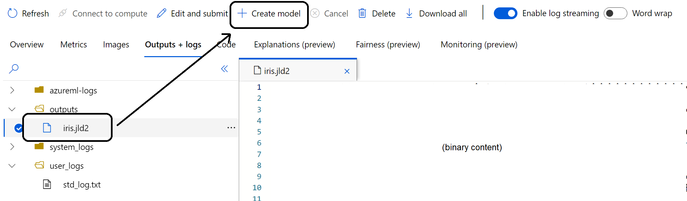

# Training models with Julia in Azure ML

Although Julia is not preinstalled in Azure Machine Learning, the platform supports execution of Machine Learning models or any other code using this language.

In this repository, you will find an example about how to train a tree-based decision model using Julia (1.7.2) for the popular Iris dataset. This repository is organized as follows:

```bash
azureml-julia
├── .aml                                # Contain all the elements specific for Azure ML
│   ├── docker-context                      # Contain a docker image for running Julia version 1.7.2
│   │   ├── Dockerfile
│   ├── julia.env.yml                       # The Azure ML environment definition
│   └── train.job.yml                       # A training job definition for the Iris dataset problem
├── notebooks                           # Notebooks
│   ├── iris.jl.ipynb                       # A training job for the Iris dataset using Julia in Notebooks
├── readme.md
└── src                                 # Train source code
    └── iris.jl                             # A training job for the Iris dataset using Julia
```

## Getting started

1. Install the Azure ML CLI v2. Follow the instruction at [Install and set up the CLI (v2)](https://docs.microsoft.com/en-us/azure/machine-learning/how-to-configure-cli) if it's the first time you use it.
2. Create an Environment with Julia

    ```bash
    az ml environment create -f .aml/julia.env.yml
    ```

3. Submit a training job

    ```bash
    az ml job create -f .aml/train.job.yml
    ```

4. Once the run is completed, you can review the model and register it as a model in Azure ML:

    

## Installing a Julia Kernel in Azure ML notebooks

If you rather work interactively using notebooks, you can create a kernel with Julia support in Jupyter Notebooks. The following instructions provide a quick start:

1. Create a compute instance in the regular way.
2. Install Julia as [suggested in their official website](https://julialang.org/downloads/platform/#linux_and_freebsd). 

    ```bash
    # install julia in a Compute Instance
    export JULIA_PATH=/usr/local/julia

    wget https://julialang-s3.julialang.org/bin/linux/x64/1.7/julia-1.7.3-linux-x86_64.tar.gz
    sudo mkdir "$JULIA_PATH"
    sudo tar -xzf julia-1.7.3-linux-x86_64.tar.gz -C "$JULIA_PATH" --strip-components 1
    rm julia-1.7.3-linux-x86_64.tar.gz

    echo 'export PATH="/usr/local/julia:${PATH}"' >> ~/.bashrc
    ```

    > **Important:** Installation instructions are provided as-is, but they don't represent any preference of installation or best-practice. You should check them with the platform administrator to ensure they comply with your organization policies.

3. Install the kernel in Jupyter:

    ```bash
    # create a conda environment
    conda create -n julia Python=3.8.5
    conda activate julia

    # install the kernel
    julia -e 'using Pkg; Pkg.add("IJulia");'
    ```

## Contributing

This project welcomes contributions and suggestions. Open an issue and start the discussion! **Don't be shy!**